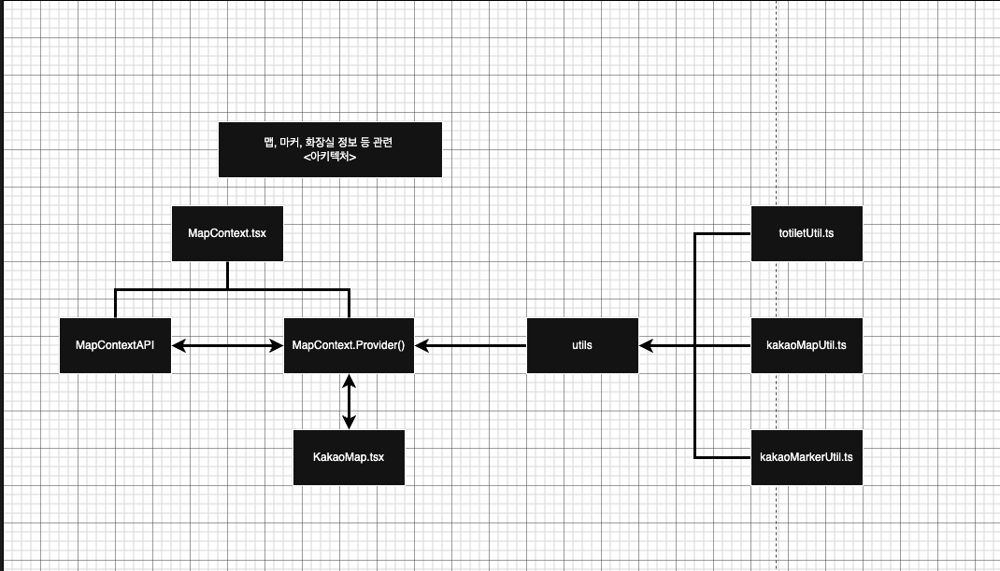

260304

- 기존 README.md에 있던 내용 memo.txt로 이관

- 맵 위에 개방 여부 / 현재 위치가 무슨 색인지 보여주는 ui 생성 (추후 컴포넌트로 분리 예정)

- 현재 내위치로 이동하고 마커 생성하는 gps svg 추가 (추후 이벤트 넣을 예정, 디자인이 이상한데 왜인지 몰겠음)

- fillter 관련, ui의 색이 어떻게 바꾸는건지 이해를 못했음, 이걸 이해해야 에러 고칠듯

- 중요한거

1. 현재는 각각의 util에서 필요한걸 가져다가 쓰는 형식, 좋긴한거 같은데 구분하기 힘든거 같음 => 예를 들어 하나의 컴포넌트에서 1. 맵에 찍힌 마커를 지운다. 2. 맵에 마커를 생성한다. 3. 맵에 마커를 그린다. 라는 과정이 있다고 했을때 1, 2, 3의 과정이 한눈에 파악하기 힘들음 => 해결 방법 예시 코드

```ts

render() => {
  if(marker.length > 0) render1(); // 기존 마커가 있다면 marker를 초기화
  render2(); // 마커를 생성하고 코드
  render3(); // 마커를 맵에 렌더하는 코드

  // **수정**
  // 위와 같은 방식으로 하려 했으나 내 코드가 특정 값을 생성하고, 해당값을 상태업데이트 or 다른 값의 상태 업데이트에 사용됨. 이와 같은 이유로 아래의 규칙은 만들었음

  // **규칙** (/src/pages/home/mapRender.ts 파일 보시면 이해 편합니다)
  // 1. 각자의 실행 구역을 주석으로 나누기

  // -------------------------------------------------------------------------------------------------
  // change toilet state 시작
  const currToilet: Toilet[] = await getToiletByLatLon(lat, lng); // 주변 화장실 정보 api
  setToilet(currToilet);
  // change toilet state 종료
  // -------------------------------------------------------------------------------------------------

  // -------------------------------------------------------------------------------------------------
  // 2. 다른 값에 의해 생성되는 값들이 아닌 변수는 함수 맨위의 변수 필드에 정의하기
  const { lat, lng } = await currLocation(); // currnet location { lat, lng }
  // -------------------------------------------------------------------------------------------------

  // -------------------------------------------------------------------------------------------------
  // 3. 다른 값에 의해 생성되는 값들은 보통 상태 업데이트를함 => 값 생성 + 상태 업데이트는 하나의 render로 봄
  // render2 : 현재 위치 상태 업데이트 시작
  const myMarker = createMarker(newMap, lat, lng, "내 위치");
  setCurrLocMark(myMarker);
  // render2 : 현재 위치 상태 업데이트 종료

  // 3-1. 화면에 영향을 끼침 => state , 화면에 영향은 끼치지않지만 값은 변경 => change
  // -------------------------------------------------------------------------------------------------


  // 단일 책임 원칙을 지키기 => 느슨한 연결이 가능(내가 만든 방식이 느슨한 연결인지는 모르겠따)
  // 생각해야 되는건 render하는 과정을 다른 컴포넌트와 동일하게 사용할건지?
  // kakaoMap.tsx, SearchLocation.tsx, MapFilter 전부 바꾸기
}
```

2. 동적으로 다룰땐 이벤트 위임을 사용, map의 key값을 index가 아닌 고유한 값을 주기 : 리액트의 map으로 컴포넌트를 만들때 고유한 값을 주기에 이벤트 위임은 상관없지만 하나의 태그에 이벤트를 위임시켜주면 아래 컴포넌트에 이벤트가 전파되기에 메모리적으로 효율적인거같음

- 중요한거 1부터 작업후, 맵 개방 여부, gps 버튼 작업 예정

# kakaoMap.tsx 백업용

```tsx
import { useEffect } from "react";
import * as kakaoMapUtil from "../../utils/homeUtil/kakaoMapUtil";
import * as kakaoMarkerUtil from "../../utils/homeUtil/kakaoMarkerUtil";
import { useMap } from "../../contexts/MapContext";
import {
  getToiletByLatLon,
  type Toilet,
} from "../../utils/homeUtil/totiletUtil";
import CurrLocBtn from "./CurrLocBtn";

export default function KakaoMap() {
  const {
    setMap,
    setMarkers,
    setToilet,
    isLoading,
    setIsLoading,
    setCurrLocMark,
  } = useMap();

  useEffect(() => {
    setIsLoading(true);

    kakao.maps.load(() => {
      const startApp = async () => {
        try {
          const { lat, lng } = await kakaoMapUtil.currLocation(); // 현재 위치 위도경도
          const newMap = kakaoMapUtil.createkakaoMap(lat, lng); // 맵 객체 생성
          setMap(newMap); // 맵 객체 상태 업데이트

          if (newMap == null) return; // 맵이 생성되었을 경우

          // 현재 위치의 마커를 맵에 생성하고 tempMarkers에 저장
          const myMarker = kakaoMarkerUtil.createMarker(
            newMap,
            lat,
            lng,
            "내 위치",
          );
          // 내 위치 마커 객체 업데이트
          setCurrLocMark(myMarker);

          // 맵의 마커들을 담을 변수 : 내 위치와 주변 화장실 정보를 담기 추후 마커 삭제를 위해 필요
          const tempMarkers: kakao.maps.Marker[] = [];

          tempMarkers.push(myMarker);

          // 주변 반경 1km 화장실 정보 가져오기
          const currToilet: Toilet[] = await getToiletByLatLon(lat, lng); // toiletRef의 값 바꾸기

          // 화장실 상태 업데이트
          setToilet(currToilet);

          // 만약 totiletDatas가 array일 경우 (=주변 화장실이 있을경우)
          if (Array.isArray(currToilet)) {
            // 모든 화장실의 값을 맵에 찍어주기 + tempMarkers에 저장
            currToilet.forEach((toilet: Toilet) => {
              const marker = kakaoMarkerUtil.createMarker(
                newMap,
                toilet.tlat,
                toilet.tlot,
                toilet.tname,
              );
              tempMarkers.push(marker);
            });
          }

          // 전역 상태에 모든 마커 저장 (그래야 SearchLocation에서 지움)

          setMarkers(tempMarkers); // 마커들의 정보를 수정하는 setMarkers, markers의 값 수정
        } catch (error) {
          console.error(error);
        } finally {
          setIsLoading(false);
        }
      };

      startApp();
    });
  }, []); // useEffect로 맨 처음 실행되었을때만 맵을 그림

  return (
    <div
      className="position-relative shadow-sm rounded mx-auto w-100"
      style={{ minHeight: "500px" }} // 지도가 들어갈 최소 높이 확보
    >
      {/* 1. 지도를 먼저 렌더링 (항상 존재해야 함) */}
      <div id="map" className="shadow-sm rounded mx-auto"></div>
      <CurrLocBtn />

      {/* 2. isLoading일 때만 그 위에 덮어씌우는 로딩 레이어 */}
      {isLoading && (
        <div
          className="position-absolute top-0 start-0 w-100 h-100 d-flex flex-column align-items-center justify-content-center bg-white shadow-sm rounded"
          style={{
            zIndex: 10,
            opacity: 0.9,
            left: 0,
            right: 0,
          }}
        >
          <div className="spinner-border text-primary" role="status">
            <span className="visually-hidden">Loading...</span>
          </div>
          {/* 텍스트가 세로로 나오지 않도록 w-100과 text-center 추가 */}
          <p className="mt-3 fw-bold text-primary w-100 text-center">
            지도를 불러오고 있습니다...
          </p>
        </div>
      )}
    </div>
  );
}
```

# 새로운 아키텍처

- MapContext API

- MapContext.provider()

- Utils

1. toiletUtil.ts

2. kakaoMapUtil.ts

3. kakaoMarkerUtil.ts

## 결과

- MapContext.provider()를 기준으로 전역변수와 유틸 함수들을 조합하는 함수를 export 해주기

- kakaoMap 기준으로 어떤식의 코드 변화가 있는지 정리

```tsx
// kakaoMap.tsx

// before
const newMap = kakaoMapUtil.createkakaoMap(lat, lng); // 맵 객체 생성
setMap(newMap); // 맵 객체 상태 업데이트

// after
const newMap: kakao.maps.Maps = changeStateMap(lat, lng);

// MapContext.tsx
const changeStateMap = (lat: number, lng: number) => {
  const map: kakao.maps.Map = kakaoMapUtil.createkakaoMap(lat, lng); // 맵 객체 생성
  setMap(newMap); // 맵 객체 상태 업데이트
  return map;
};
```

- README.md -> 우클릭 -> 미리 보기 열기 눌러주세요
  

# 20260312

- kakaoMap이랑 MapFilter를 봤을때 뭐가 더 이해하기 쉬운건지 물어보기 (주석을 지울까?)

```tsx
// 필터 & 화장실 정보 갱신 & 마커 생성

// 1. 화장실 리스트와 화장실 필터를 입력 받는다, (기존 화장실 정보를 가져올때도)
// 2. 개방 시간과 현재 시간을 비교해서 컬러도 바꿔줘야 되네 (마커 생성하는 부분 수정)
// 3. if (toiletOption.기저귀 && 기저귀 != "Y") return false; 이게 true인 것들 출력 => 상시 필터 유지
// 4. 필터가 항상 최신값이여야 되기떄문에 useState대신 하나의 객체를 만들어 그 값을 넣어서 필터하기

// 현재 위치

// 현재 위치 버튼 테두리 없애기

// 현재 위치가 있을 경우 currLocMark != null => 파란색
// 현재 위치가 없을 경우 currLocMark == null => 검정색

// 현재 위치 클릭시
// currLocMark == null인 경우에만 현재 위치 불러오는 코드를 만들기
// currLocMark != null인 경우 현재 위치로 이동
```

- 업데이트 내용

1. kakaoMap에 저번에 만든 아키텍처 구조를 적용시켰음, 가독성 조금 좋아진거 말곤 뭐 없는듯함

2. 리액트 라우터로 헤더 처리 완료

3. /login 입력시 login 컴포넌트 페이지로 이동 설정 완료

4. 현재 / 페이지에서 -> /login 이동 -> / 이동시 값 유지가 안되서 화면이 초기화되는것을 확인했음 (요약 : 새로 고침이됨)

# 20260316 (13일 ~ 15일 작성은 깃허브 업데이트는 커맨트 확인)

- 수정 필요한것들

1. 모달 창 생성

2. 단일책임원칙 - 자꾸 툭정함수에서 기능을 두개이상하고 있음 ex) 이메일 중복 체크 함수 => 이메일 형식을 체크와 이메일 중복 체크 두가지를 하고 있음

3. 2번을 안지켜서 onClick 이벤트에서 이메일 중복 체크 함수를 넣고 있음. emailHandling 이런식으로 함수를 하나 만들어서 흐름을 집어 넣어야할듯

4. 부트스트랩 통합 : 현재 부트스트랩이 중복되는게 많은걸 알았음. 이걸 bootstrapStyle.ts로 만드는게 나을듯

5. css 통합 or 제거 : 이것도 4번과 마찬가진데 css 이름이 중복되거나 내용물이 똑같은게 많음 디테일을 css로 짜고 그외에는 부트스트랩으로 빼야할듯함

6. custom hook 공부하기, input태그에 value={}, onChange={} 이부분이 중복되는데 각각 값이 달라서 useState가 input의 수만큼 늘어남 (signup.tsx)

7. 회원가입 기능까지 만들었는데 실제로 동작하는지는 모름 (테스트 해야됨 )

8. 앞으로의 README 작성 방식 : 업데이트 내용과 수정해야할것을 작성 해두기, 커밋하기전 내용을 커밋 커맨트로 옮긴후 README의 수정 내용은 삭제, 업데이트 내용만 남겨두기

# 20260317

- 수정 내용

1. api/authApiUtil.ts의 ENDPOINT 변수에 백틱하나 들어가서 경로 에러 => 수정 완료

2. navigator() 사용시 .ts파일에서는 호출이 안되는것을 확인 / get과 post 요청이 에러가 뜬다면 => null 반환 / return값이 null => 404페이지로 이동?

3. 정규식 테스트하는 부분이 참일경우 에러를 주게 되어있었음 => 수정 완료

4. package.json의 script { dev : vite --host 127.0.0.1 }로 수정 기존 경로 localhost:5173에서 127.0.0.1:5173 => 수정 완료

- 업데이트 내용

1. router/routing.tsx 생성

2. hominPark@homin.com 회원가입 완료
